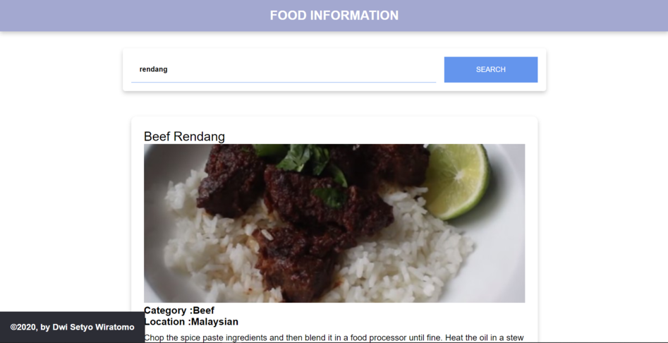

# Food_Information
Final submission untuk course dicoding Belajar Fundamental Front-End Web Development menggunakan resource API dari TheMealDB : https://www.themealdb.com/api.php.

#Display
You can see the results in the following link : [food-information.vercel.app](https://food-information.vercel.app)

Step :
1. install dependencies using npm
`npm install`
2. run server
`npm run start-dev`

